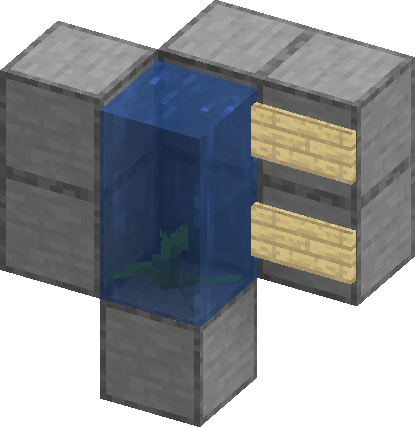

# 🧭 Getting Started

## 🌱 Early Game

Your first days can be tough — here’s what you’ll need to stay ahead:

*  Animals
*  Crops
*  Grass
*  Sand (If you want  Glass)
*  Saplings


**Tip:** Build your base **below Y=0** — the Sun becomes deadly above that level until **day 100.**


## 🌊 Make It Flow

Learn how to generate an infinite water source.

**Requirements:**

*  Building Blocks
*  1x Kelp
*  1x Water Bucket

**Steps:**

1. Place water in one block, leaving a one-block gap beside it.
2. Place kelp under the water.
3. Break the kelp.
4. Collect water where the kelp was.

<figure><figcaption></figcaption></figure>

